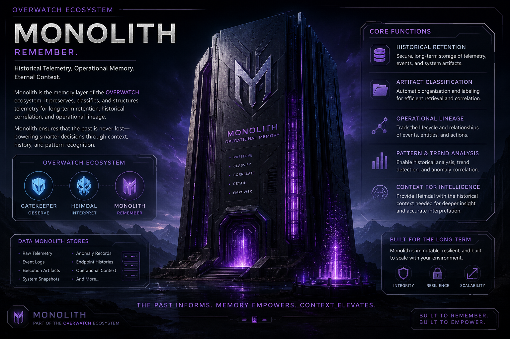

# OVERWATCH Monolith

## Historical Telemetry. Operational Memory. Eternal Context.

Monolith is the memory subsystem of the OVERWATCH ecosystem.

Its purpose is to preserve operational intelligence, protect historical integrity, maintain contextual awareness, and provide long-term organizational memory.

Monolith ensures that critical telemetry, intelligence findings, operational decisions, and historical events are never lost, enabling future analysis, correlation, and informed decision-making.

---

## Mission

Observe.

Interpret.

Remember.

Protect.

---

## Core Responsibilities

### Historical Retention

* Preserve telemetry history
* Archive intelligence findings
* Store operational context
* Maintain long-term records

### Integrity Protection

* Generate SHA256 integrity hashes
* Verify archived record authenticity
* Detect unauthorized modification
* Support chain-of-custody validation

### Intelligence Preservation

* Preserve operational lineage
* Maintain contextual awareness
* Enable historical analysis
* Support future investigations

### Future Intelligence Correlation

* Historical pattern detection
* Relationship mapping
* Event correlation
* Graph-based intelligence analysis

---

## Current Proof of Concept Capabilities

### Archive Records

Structured intelligence records containing:

* Endpoint information
* Risk assessments
* Stability assessments
* Findings
* Timestamps

### Integrity Engine

* SHA256 hash generation
* Integrity verification
* Tamper detection foundation

### Storage Manager

* Record persistence
* Archive retrieval
* Historical record preservation

### Intelligence Vault

* Archive storage
* Hash-protected records
* Operational memory preservation

---

## OVERWATCH Ecosystem

| Layer              | Component   | Responsibility                          |
| ------------------ | ----------- | --------------------------------------- |
| Observation        | GateKeeper  | Security Testing & Telemetry Collection |
| Communication      | Ratatoskr   | Secure Intelligence Transport           |
| Intelligence       | Heimdal     | Analysis, Correlation & Interpretation  |
| Memory             | Monolith    | Historical Preservation & Integrity     |
| Investigation      | Black Cells | Quarantine & Investigation              |
| Adjudication       | Odin        | Decision Authority                      |
| Command            | Thor        | Strategic Response Coordination         |
| Execution          | Mjolnir     | Automated Defensive Actions             |
| Precision Response | Gungnir     | Targeted Remediation                    |
| Containment        | Fenrir      | Emergency Isolation & Containment       |

---

## Current Development Status

**Status:** Proof of Concept (PoC)

### Operational Components

* GateKeeper
* Heimdal
* Monolith

### Demonstrated Capabilities

* Observation
* Intelligence Analysis
* Historical Preservation
* Integrity Verification

### Next Major Milestone

Ratatoskr Communication Layer

---

## Architecture Philosophy

Trust Nothing.

Verify Everything.

Preserve Truth.

Monolith is not a database.

Monolith is OVERWATCH's memory.

---

## Long-Term Vision

Create a cybersecurity intelligence ecosystem capable of:

* Observing operational activity
* Interpreting telemetry intelligence
* Preserving historical context
* Investigating anomalous behavior
* Adjudicating operational decisions
* Executing defensive actions
* Maintaining explainable intelligence

The Past Informs.

Memory Empowers.

Context Elevates.
